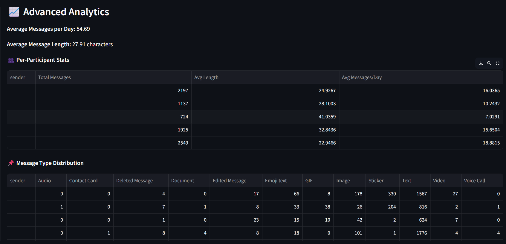
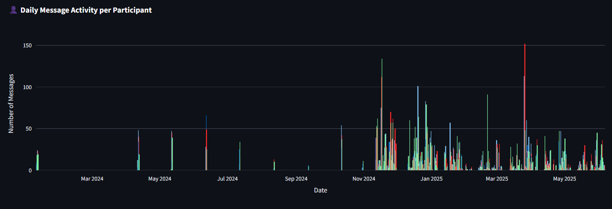

# 💬 WhatsApp Chat Analyzer with RAG & LLM


A powerful and modern way to analyze WhatsApp chats using Retrieval-Augmented Generation (RAG), contextual semantic search, visual insights, and LLM-based query expansion — all in a beautiful Streamlit app!

---

##  Features

###  Contextual & Semantic Search (RAG)
- Supports **TF-IDF**, **BM25**, **FAISS**, and **Hybrid Fusion**
- Uses **Reciprocal Rank Fusion (RRF)** to merge scores from multiple search methods
- Optional **query expansion using local LLMs via [Ollama](https://ollama.com/)**

### Visual Analytics
-  Per-Participant Stats
-  Messages by Weekday
-  Hourly Activity per Sender
-  Message distribution over time
-  Daily participation of each member
-  Burst detection to highlight sudden activity spikes
-  Most active hours and days
-  Heatmap of Daily Activity by Participant
-  Daily Activity by Participant

###  Streamlit UI
- Responsive and interactive chat analyzer interface
- Contextual search bar
- Clean visualization of chat trends and user behavior

---

##  Sample Visualizations

| Message Distribution | User Activity Over Days |
|----------------------|-------------------------|
|  |  |

---

##  Getting Started

### 1. Clone the Repo

```bash
git clone https://github.com/AkhshanAchu/whatsapp-rag-analyzer.git
cd WhatsappChatRag

```
### 2. Install Requirements

```bash
pip install -r requirements.txt
```

### 3. Setup Ollama for LLM
> Make sure Ollama is installed and running:

```bash
ollama run **Your Model**
```
### Usage
- Export a WhatsApp chat in .txt format
- Place the file inside the data/ folder (e.g. data/chat.txt)
- Run the app:
```bash
streamlit run app.py
```


